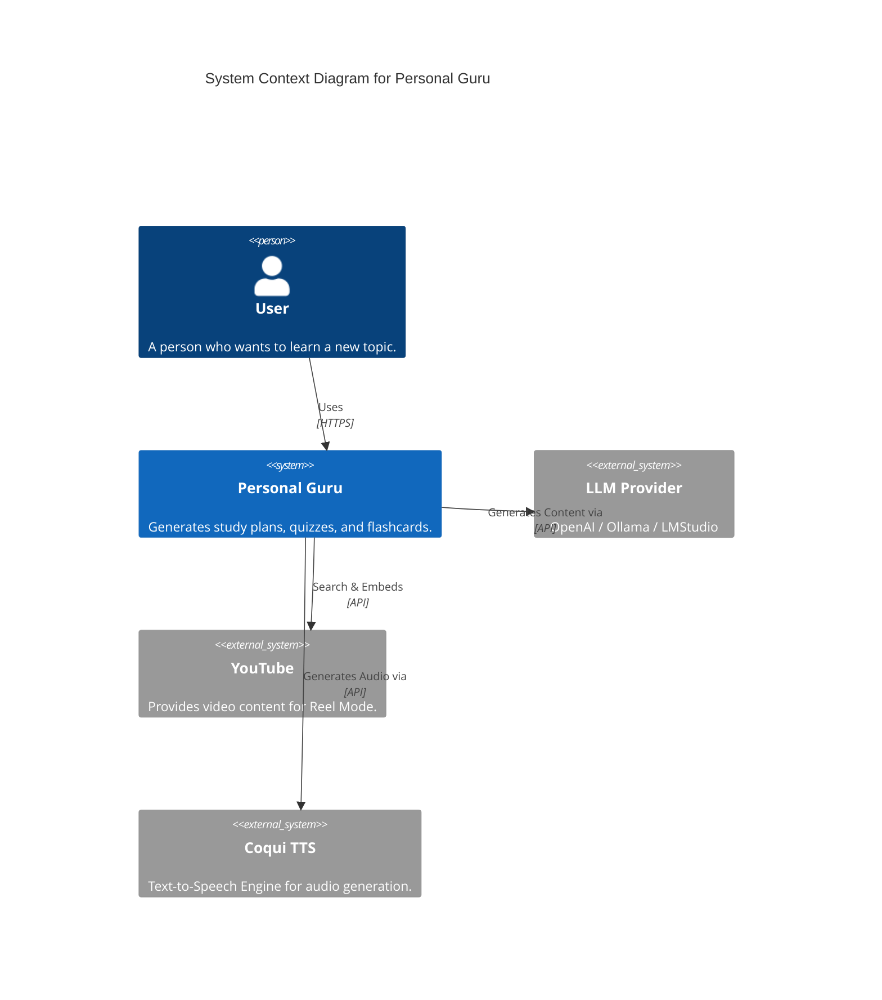
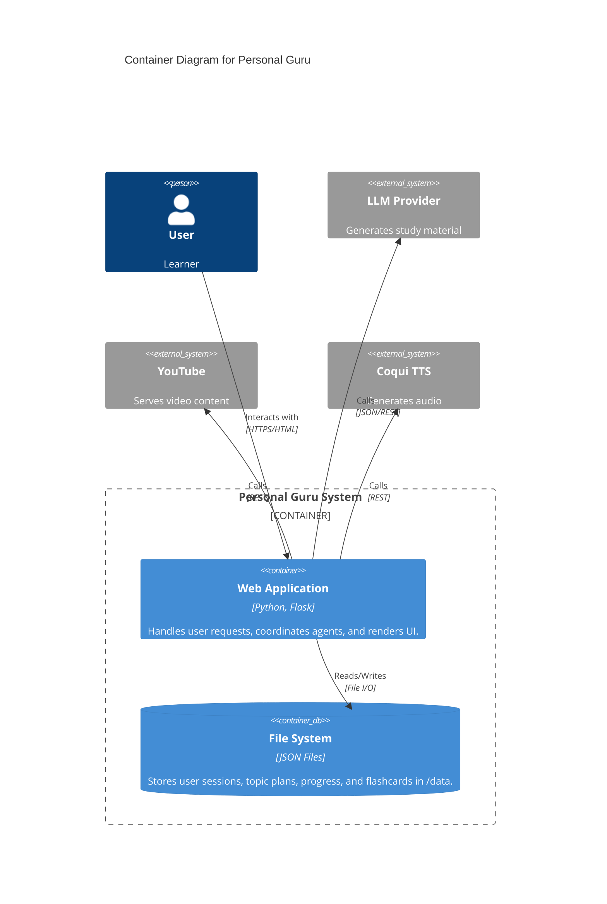
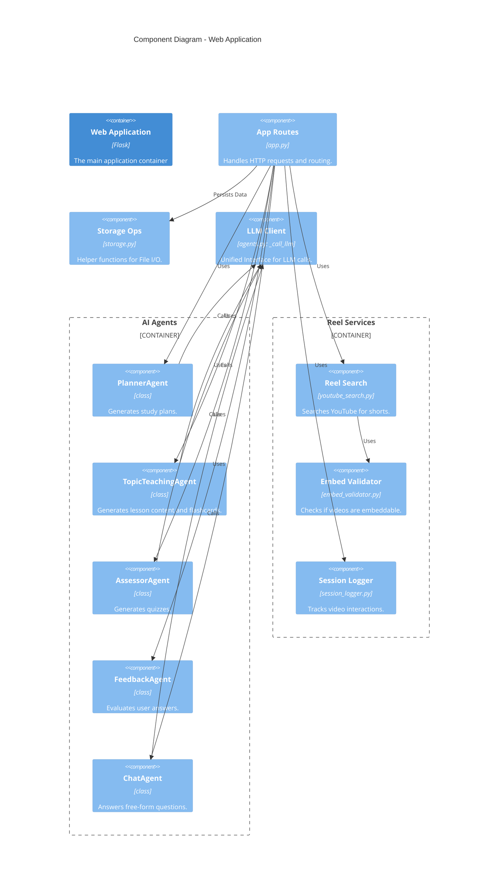
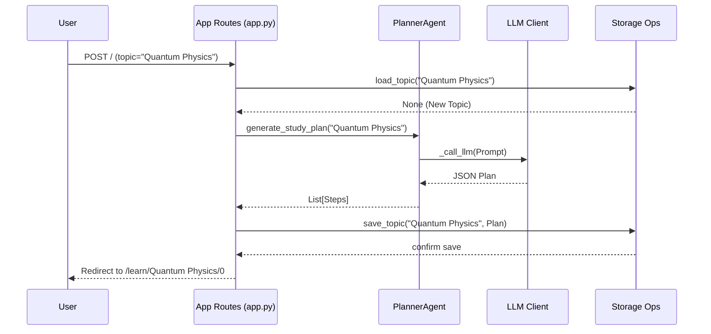
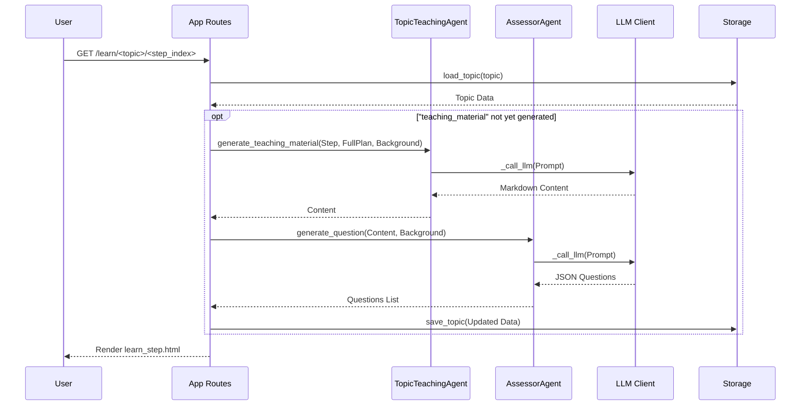
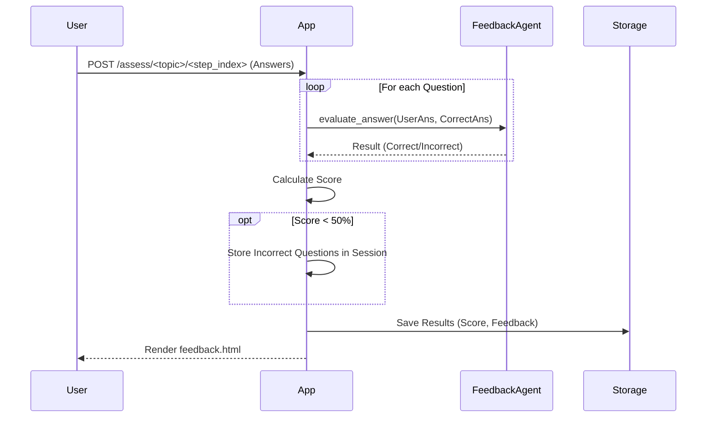
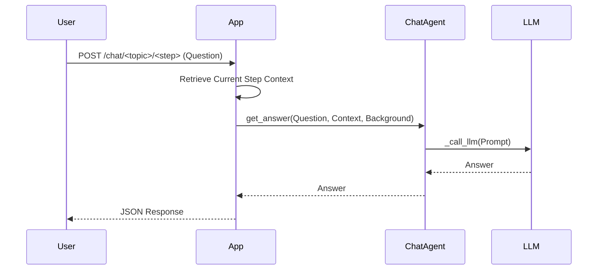
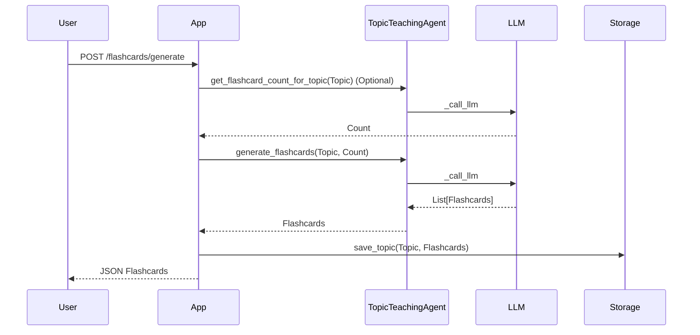
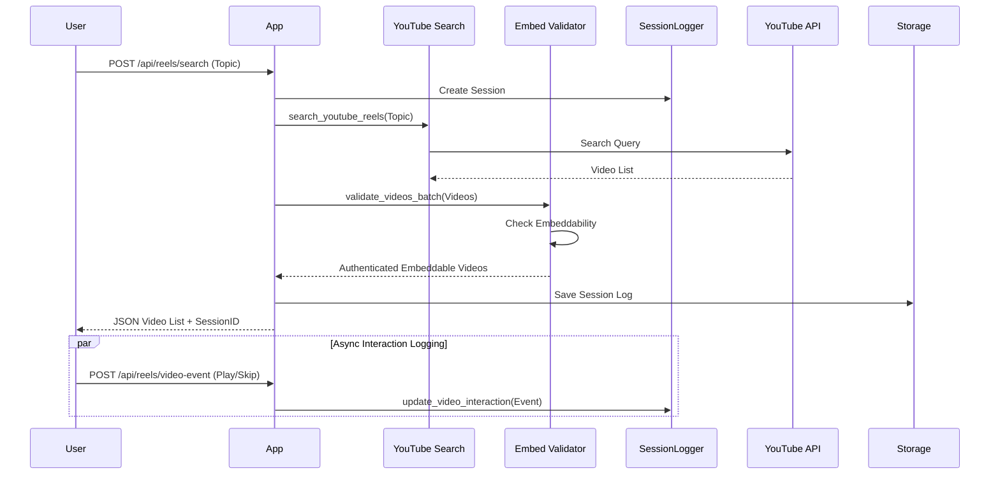
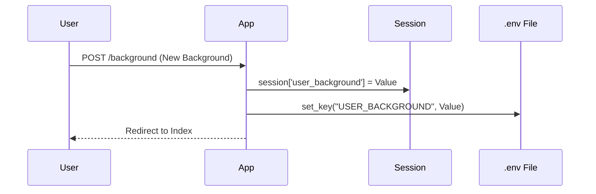

# Software Architecture

This document describes the high-level architecture of the Personal Guru application using the C4 model.

## 1. System Context Diagram (Level 1)

This diagram shows the Personal Guru system in the context of its users and external systems.

## 2. Container Diagram (Level 2)

This diagram shows the high-level technical building blocks of the system.

## 3. Component Diagram (Level 3)

This diagram breaks down the Web Application into its core logical components.

## 4. Dynamic Views (Sequence Diagrams)

### 4.1 Generate Study Plan
**Use Case:** User enters a topic to start a new course.

### 4.2 Study Step Loading (Content Generation)
**Use Case:** User clicks "Start Learning" or "Next Step". The system generates content and quiz questions on-the-fly.

### 4.3 Assessment & Feedback
**Use Case:** User submits answers to the quiz at the end of a step.

### 4.4 Q&A Chat
**Use Case:** User asks a clarifying question about the reading material.

### 4.5 Flashcard Generation
**Use Case:** User requests flashcards for a topic.

### 4.6 Reel Search & Interaction
**Use Case:** User searches for educational shorts in Reel Mode and swipes/views them.

### 4.7 Set User Background
**Use Case:** User updates their persona (e.g., "Beginner", "Expert").

